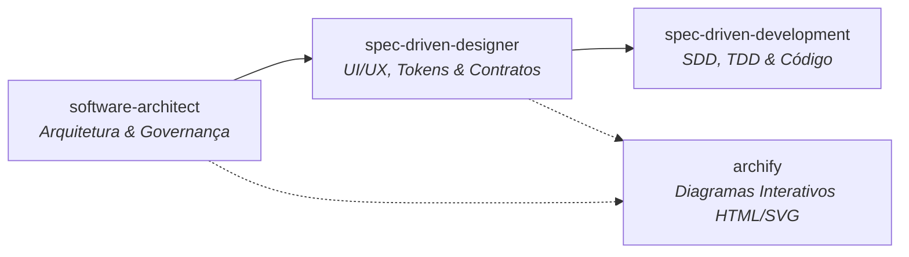

# 🚀 Catálogo de Skills para Agentes Inteligentes

Coleção de **Custom Skills** para agentes de desenvolvimento de software baseados em IA (compatível com Antigravity / Gemini Agentic Workflow). Este repositório centraliza diretrizes de arquitetura de soluções, design centrado em especificações, desenvolvimento orientado a specs (SDD) e geração automatizada de diagramas interativos.

---

## 🎯 Visão Geral do Ecossistema

As skills presentes neste workspace se complementam para cobrir todo o ciclo de vida do desenvolvimento de software, desde a concepção arquitetural até a entrega do código e documentação visual:



---

## 📦 Skills Disponíveis

### 1. 🏛️ `software-architect`
**Localização:** [`.agents/skills/software-architect`](file:///d:/Projetos/skillexemplos/.agents/skills/software-architect/SKILL.md)  
**Papel:** *Arquiteto de Soluções Senior / Principal Engineer*  
Guia o desenho de sistemas aplicando 5 pilares fundamentais:
* **Arquitetura de Software:** Padrões arquiteturais (Clean Architecture, Hexagonal, Microsserviços), desacoplamento, resiliência (Circuit Breaker, Retries, Rate Limit) e ADRs.
* **Segurança (DevSecOps):** Hashing de senhas com **Argon2id + Pepper** (HMAC-SHA256 via segredo no `.env`), conformidade LGPD/GDPR, OAuth2/OIDC e OWASP Top 10.
* **Infraestrutura & Operações:** IaC (Terraform/Ansible), Docker/K8s, CI/CD automatizado e Observabilidade (Logs estruturados, Prometheus, OpenTelemetry).
* **Seleção de Tecnologia:** Escolha pragmática de Tech Stack focada no problema de negócio, sem *Hype-Driven Development*.
* **Qualidade & Testes:** Pirâmide de Testes (Unitários, Integração, E2E) e análise estática (Linters / SonarQube).
* **Artefatos e Diagramas:** Geração de blueprints (`architecture.md`, `security-plan.md`, `DIAGRAMS.md` com Mermaid e fluxos com Archify).

---

### 2. 🎨 `spec-driven-designer`
**Localização:** [`.agents/skills/spec-driven-designer`](file:///d:/Projetos/skillexemplos/.agents/skills/spec-driven-designer/SKILL.md)  
**Papel:** *Lead System & Product Designer*  
Focado em modelar interfaces, design tokens e contratos de API **antes** de qualquer implementação visual:
* **Escolha Interativa de Stack:** Sempre consulta a preferência do usuário (React, Vue, Angular, Svelte, Vite, HTMX, HTML/CSS).
* **Abordagem API-First:** Mapeamento de contratos OpenAPI e JSON Schemas necessários para alimentar as telas.
* **Mapeamento de Estados:** Especificação de todos os estados de UI (`Carregando`, `Sucesso`, `Vazio`, `Erro`, `Desabilitado`).
* **Design Tokens & Acessibilidade:** Cores, tipografia, espaçamentos sem "magic numbers", conformidade WCAG e foco acessível.
* **Componentes Ricos:**
  * Tabelas de dados responsivas com cabeçalho congelado, paginação e exportação para CSV, Excel e PDF.
  * Filtros e barras de busca persistentes.
  * Modais e fluxos de confirmação de exclusão de dados com diferenciação visual de botões de ação destrutiva.
* **Artefato Gerado:** `DESIGN_SPEC.md` (Jornada, Componentes, Contratos JSON e Validações de Formulário).

---

### 3. 🧪 `spec-driven-development`
**Localização:** [`.agents/skills/spec-driven-dev`](file:///d:/Projetos/skillexemplos/.agents/skills/spec-driven-dev/SKILL.md)  
**Papel:** *Engenheiro de Software Guiado por SDD*  
Impõe a metodologia **Spec-Driven Development** (SDD) através de uma regra de ouro: **Nenhum código é escrito antes da aprovação de uma especificação (`.spec.md`)**.
* **Fase 1 (SPEC):** Criação do arquivo `specs/<feature>.spec.md` cobrindo objetivos de negócio, segurança, infraestrutura, modelos de dados, contratos de API e plano de testes. Aguarda aprovação explícita do usuário.
* **Fase 2 (Test-First):** Criação de testes automatizados baseados na especificação que falham inicialmente (*Red stage*).
* **Fase 3 (Implementação):** Geração do código mínimo estritamente necessário para aprovar os testes (*Green stage*), evitando desvios de escopo (*No Scope Creep*).
* **Comandos Aceitos:**
  * `@spec create <feature>`: Cria o rascunho completo da especificação.
  * `@spec validate`: Revisa a SPEC buscando brechas de segurança ou ausência de testes.
  * `@spec implement`: Executa a geração do código a partir da SPEC aprovada.

---

### 4. 📊 `archify`
**Localização:** [`.agents/skills/archify`](file:///d:/Projetos/skillexemplos/.agents/skills/archify/SKILL.md)  
**Papel:** *Gerador de Diagramas Interativos em HTML/SVG*  
Cria diagramas standalone de alta fidelidade a partir de especificações JSON validadas ou convertendo trechos Mermaid:
* **Tipos de Diagramas:**
  | Tipo | Finalidade Principal |
  |---|---|
  | `architecture` | Componentes, serviços, fronteiras de segurança/cloud, infraestrutura |
  | `workflow` | Processos operacionais, aprovações, CI/CD, runbooks |
  | `sequence` | Cadeias de chamadas de API, rastreamento assíncrono, ciclo de requisição |
  | `dataflow` | Pipelines de dados, ETL/ELT, linhagem e governança |
  | `lifecycle` | Máquinas de estados, transições, retries e estados terminais |
* **Recursos do Visualizador:** Suporte a temas Dark/Light, pan/zoom, busca, foco de nós, trace de animação (`trace motion`) e exportação direta em PNG, JPEG, WebP, SVG e WebM.
* **Validação Rigorosa:** Verificação formal com `node bin/archify.mjs validate <tipo> <spec.json> --quality showcase`.

---

## 📂 Estrutura de Pastas

```plaintext
.
├── .agents/
│   └── skills/
│       ├── archify/                # Gerador de diagramas interativos HTML/SVG
│       │   ├── bin/                # CLI do archify (doctor, validate, deliver)
│       │   ├── schemas/            # Schemas JSON dos diagramas
│       │   ├── examples/           # Exemplos de diagramas para referência
│       │   └── SKILL.md            # Instruções da skill archify
│       ├── software-architect/     # Diretrizes de arquitetura e governança
│       │   └── SKILL.md            # Instruções da skill software-architect
│       ├── spec-driven-designer/   # Modelagem de UI/UX, tokens e contratos
│       │   └── SKILL.md            # Instruções da skill spec-driven-designer
│       └── spec-driven-dev/        # Metodologia SDD e TDD
│           └── SKILL.md            # Instruções da skill spec-driven-development
└── README.md                       # Documentação do repositório
```

---

## 🛠️ Como Utilizar no Workspace

Quando este workspace estiver aberto no ambiente do agente (ex: Antigravity IDE), as skills dentro de `.agents/skills/` são detectadas automaticamente.

### Exemplos de Prompts para Acionar as Skills

1. **Desenho Arquitetural:**
   > *"Atue com a skill `software-architect` para desenhar a arquitetura de uma plataforma de pagamentos distribuída com alta disponibilidade."*

2. **Design de Telas e Contratos de API:**
   > *"Use a skill `spec-driven-designer` para planejar a tela de dashboard financeiro com tabela de transações e filtros."*

3. **Criação de Features via SDD:**
   > *"@spec create Autenticação e Gestão de Usuários"*  
   > *(Aguarde a geração da spec, revise e depois solicite `@spec implement`)*

4. **Geração de Diagramas Interativos:**
   > *"Utilize a skill `archify` para gerar um diagrama interativo de arquitetura dos nossos microsserviços."*

---

## 📄 Licença

Este repositório é distribuído sob a licença **MIT**. Consulte os arquivos individuais de cada skill para mais detalhes.
